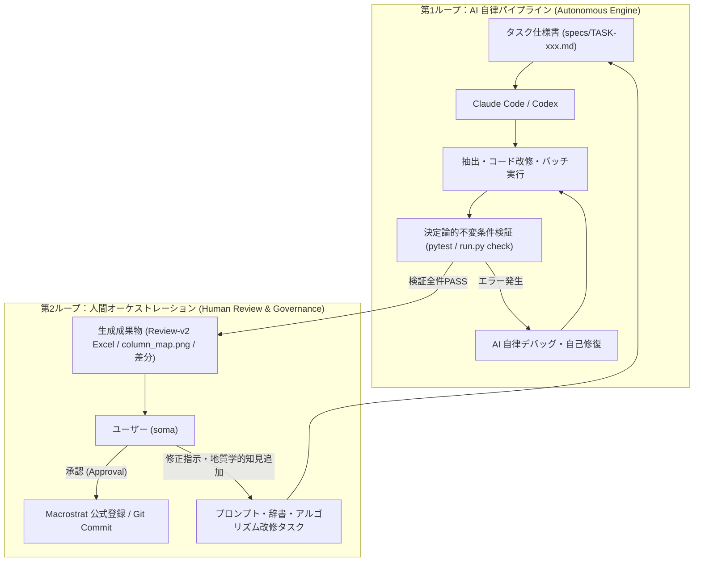

# 2層ループエンジニアリング（Double-Loop Architecture）運用仕様書

本ドキュメントは、Macrostrat Japan における開発および地質図幅デジタル化作業を、AIの自律実行（第1ループ）と人間の意思決定・レビュー（第2ループ）に分離して運用するための標準仕様書です。

---

## 1. 2層ループの構造

---

## 2. 第1ループ（AI 自律実行）の行動規範

1. **完全自律の範囲**:
   - 仕様書（`specs/TASK-xxx.md`）に記載されたスコープ内でのコード修正、スクリプト実行、および単体テストの合格までを自律的にループして完了させる。
2. **ブラックボックス化防止の制約**:
   - 変更したロジックはすべてコミットメッセージまたはタスクサマリーに平易な日本語で記録すること。
   - 年代や層序の決定根拠はすべて `verbatim_quote`（原文引用）を付与すること。
3. **終了条件**:
   - `.venv\Scripts\python -m pytest tests/` が全件 PASS すること。
   - `python run.py check <map_id>` で不変条件エラー（ERROR）が 0 件であること。

---

## 3. 第2ループ（人間オーケストレーション）の運用手順

1. **レビューシート（Excel）の確認**:
   - 生成された `mXXXX_review.xlsx` を Excel で開き、層序の上下関係、年代範囲、主要岩相を確認。
   - セルに付与されたコメント（原文引用）を見て、地質学的な違和感がないか点検。
2. **カラム配置図（`column_map.png`）の確認**:
   - 柱状図の地域区分（西域・中央・東域など）が、実際の地質図上の位置と合致しているか確認。
3. **フィードバックの注入**:
   - 修正が必要な場合、Antigravity に対話で指示を出す（例:「一戸層の上限年代を0.5Ma修正するルールを追加して」）。
   - Antigravity が新たな仕様書を作成し、第1ループに投入する。