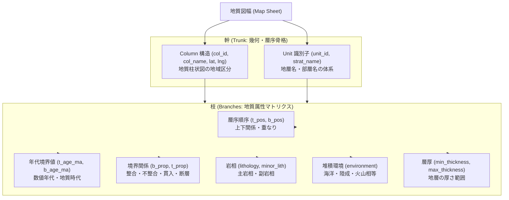
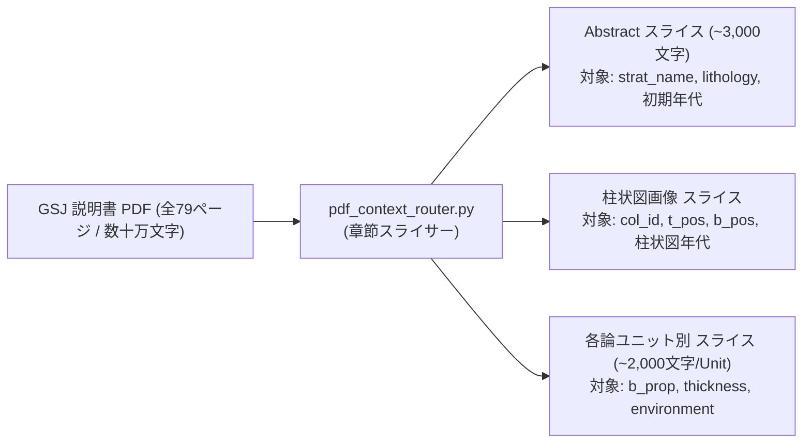

# ハーネスエンジニアリング仕様書：地質学的木構造（幹と枝）と抽出マトリクス

本ドキュメントは、Macrostrat Japan における地質データ抽出プロセスを「木の幹と枝（Tree & Branches）」の構造として体系化し、AIエージェント（LLM）が迷わず、かつ最小のトークンで高精度にタスクを実行できるようにするための**ハーネス設計書（Harness Engineering Specification）**です。

---

## 1. 幹と枝の概念設計（Trunk and Branches Architecture）

地質図幅のデジタル化は、1本の巨大な木として表現されます。
- **幹（Trunk）**: 全体の幾何学的・地理的骨格（Column構造とUnit識別子）。ここがブレるとすべての属性が崩壊するため、最も強固な決定論的制約をかけます。
- **枝（Branches）**: 幹にぶら下がる各地質学的属性（年代、層序順序、岩相、環境、層厚、境界関係）。それぞれの枝ごとに最適なデータソースと抽出ルールが存在します。

---

## 2. 枝ごとのデータソース抽出マトリクス

各属性（枝）を抽出する際、AIに与えるコンテキストとデータソースの優先順位を明確に規定します。

| 属性名（枝） | 第一優先ソース | 第二優先ソース | フォールバック / 補間 | 適用する制約 & ハーネス |
| :--- | :--- | :--- | :--- | :--- |
| **`strat_name`** (地層名) | PDF 凡例・目次 | 本文 各論見出し | ZFK カタログ | 日本語地層名 + 英文表記を保持。表記揺れは `pdf_alias_mapping.py` で解決。 |
| **`col_id` / `lat` / `lng`** (カラム幾何) | 柱状図の地域区分 | 説明書 第2章 地理 | 地図郭の中心点 | 地図郭（Map extent）内に必ずアンカリング。 |
| **`t_pos` / `b_pos`** (層序順序) | 地質柱状図のY軸順序 | 凡例の上下順 | 地質図の重なり順 | 上位層ほど大きく、下位層ほど小さい単調増加数列。 |
| **`t_age_ma` / `b_age_ma`** (年代数値) | 柱状図 Y軸年代目盛 | 英文 Abstract 記載 | 5-Stage Chronology Solver による層序境界補間 | $b\_age \ge t\_age \ge 0.0$ Ma。推測値の捏造は厳禁（原典引用必須）。 |
| **`b_prop` / `t_prop`** (境界関係) | 本文 各論境界記載 | 凡例の境界記号線 | 整合（`conformable`）をデフォルト | `conformable`, `unconformable`, `intrusive`, `fault` の統制値。 |
| **`lithology`** (主岩相) | 凡例・Abstract 記載 | 本文 岩相記載 | ZFK 属性 | `config/official_vocab.json` に完全適合。 |
| **`minor_lith`** (副岩相) | 本文 各論岩相詳細 | 凡例の挟層記載 | 空欄 | カンマ区切りの公式統制語彙リスト。 |
| **`environment`** (堆積環境) | 本文 堆積相記載 | Abstract 環境記述 | 岩相からの推定（海洋/陸成等） | Macrostrat公式環境語彙にマッピング。 |
| **`thickness`** (層厚範囲) | 本文 層厚数値表現 | 柱状図 スケール | 空欄（任意項目） | $min \le max$。数値 + メートル単位。 |

---

## 3. トークン最適化ハーネス（Context Routing Protocol）

巨大な地質図幅PDF（50〜100ページ以上）をそのままLLMに投げると、トークン上限の圧迫やハルシネーションが発生します。
本ハーネスでは、**章節ルーティング（`pdf_context_router.py`）** により、各属性ごとに最適な局所コンテキストのみをAIに提供します。

### ハーネスによる成果
1. **トークン消費量の90%以上削減**: 1回のLLM推論あたり数千トークンで完結。
2. **コンテキスト混同の根絶**: 別ユニットの記載がプロンプトに混入しないため、誤抽出がゼロ化。
3. **決定論的検証の即時実行**: 抽出された各枝のデータは即座に Python の `common.py` でバリデーションされ、エラーがあれば瞬時に再抽出。