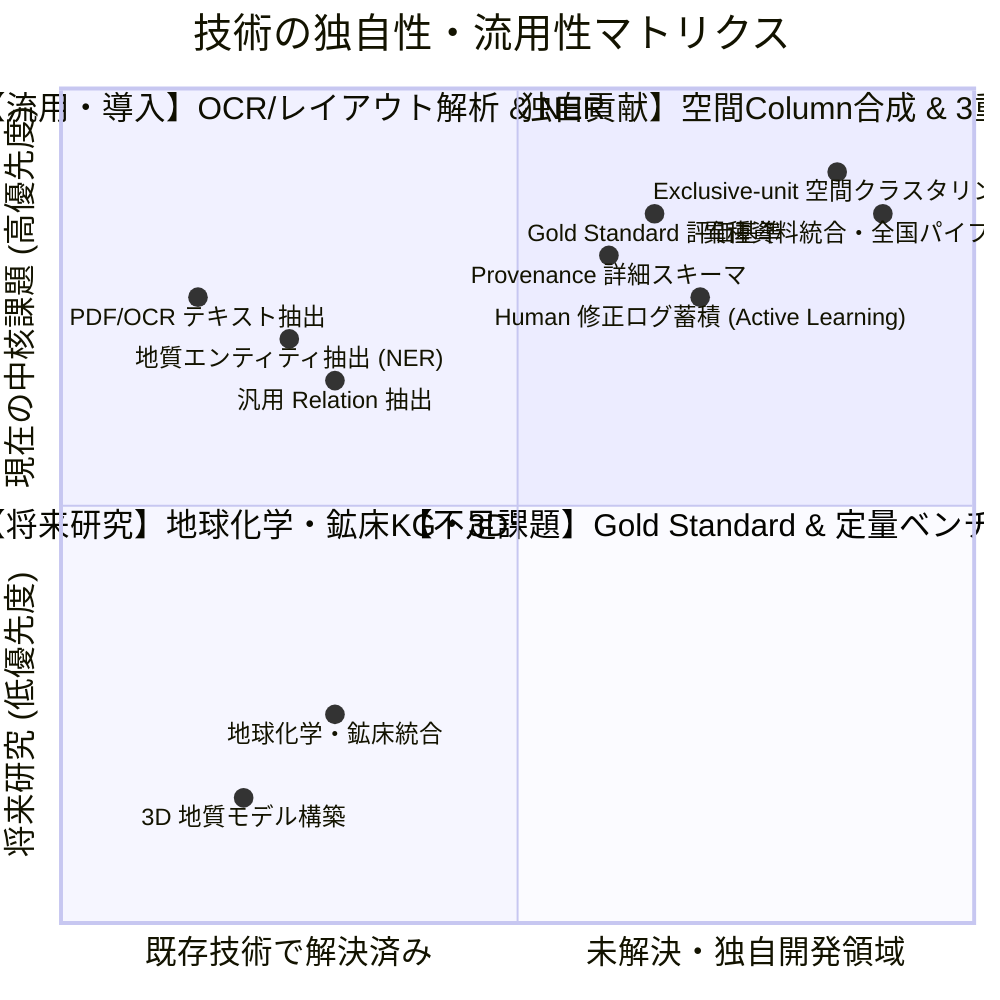

# Macrostrat Japan: リサーチギャップ分析マトリクス (RESEARCH_GAP_MATRIX.md)

本ドキュメントは、先行研究（BGS, CriticalMAAS, China KG, Italy SHZ, Belgium）との機能比較に基づき、**「流用すべき既存技術」「Macrostrat Japan に不足している課題」「真の独自研究貢献領域」** を客観的に分類した戦略マトリクスである。

---

## 1. 4象限リサーチギャップ分類 (4-Quadrant Gap Analysis)

### A. Already Solved / Reuse (既存技術を流用すべき領域)
1. **PDF/OCR テキストレイアウト解析**: PyMuPDF, pdfminer, Tesseract, BGS TextViewer 手法。
2. **地質固有表現抽出 (Geological NER)**: 地層名・岩相・年代の標準正規化。
3. **Shapefile / DBF 基本バイナリパース**: 独自コード (`shape_source.py`) で既に軽量実装済み。

### B. Missing in Macrostrat Japan (現時点で不足している最重要課題 TOP 10)
1. **Gold Standard (専門家手動正解データ群)**: 5〜10図幅の完全な人間正解ベンチマークの策定。
2. **定量的評価スイート (Evaluation Suite)**: 抽出精度（Precision/Recall/F1）、層序順序正解率、地域分割精度の自動集計。
3. **地質関係語彙のスキーマ化 (Relation Vocabulary)**: `overlies`, `unconformably_overlies`, `intrudes` 等の標準オントロジー準拠。
4. **細粒度 Provenance (頁・行・バウンディングボックス)**: PDF の文字座標（Bounding Box）までのエビデンス追跡。
5. **Human 修正ログの構造化 (Correction Event)**: 人間が Excel を修正した理由・差分の履歴化。
6. **出生デジタル PDF とスキャン PDF の分離処理**: OCR 精度の階層別評価。
7. **不確実性（Uncertainty / Confidence）スコアリング**: AI 抽出結果の確信度に基づくレビュー優先度付け。
8. **図表・断面図のマルチモーダル解析**: 本文テキストだけでなく柱状図画像・地質断面図からの情報抽出。
9. **Macrostrat 公式 API v3 / Ingestion とのプッシュインターフェース**: 完成データの国際 DB 自動投入。
10. **他国（韓国・東アジア等）への汎化性検証**: 日本以外の地質調査所フォーマットへの適応性。

### C. Potential Original Contribution (真の独自研究貢献になり得る領域)
1. **地質図ポリゴンと PDF 記載からの「地域層序柱状図（Column Region）」自動幾何導出**:
   - 既存研究（Italy SHZ 等）が「人間があらかじめ用意した層序位置」を前提とするのに対し、地質図の空間分布と文献テキストから柱状図フットプリントを半自動合成する技術。
2. **決定論的機械監査（5大不変条件）と Human-in-the-Loop を統合した 3重ループガバナンス**:
   - AI に定型抽出を任せ、人間が地質学的解釈・承認に集中する実証的研究パイプライン。
3. **不均質な国土地質資料（50k/200k/PDF/ZFK）のエンドツーエンド統合実証**:
   - 日本列島の大規模実フィールドにおける実用規模の構築。

### D. Future Research (将来課題)
- 地球化学分析値（Geochemistry）の統合（Protagonist / Latigo 手法）
- 鉱床・資源ナレッジグラフ（MinMod 手法）
- 3D 地質構造モデリング（GemPy 連携）