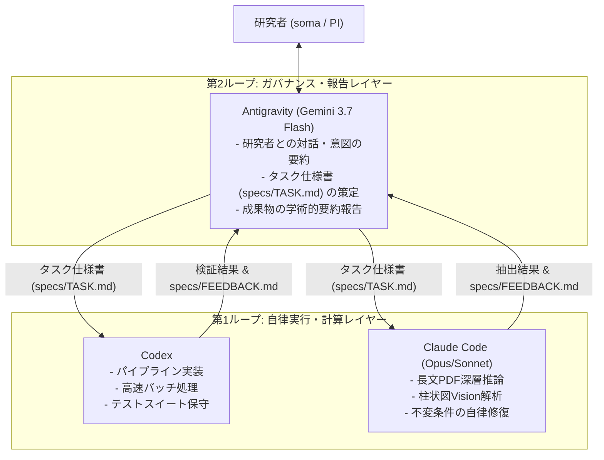

# Multi-AI Orchestration Protocol: Antigravity, Codex, & Claude Code

本ドキュメントは、Macrostrat Japan プロジェクトにおいて Antigravity, Codex, Claude Code が協調して自律開発およびデータ処理を遂行するための運用プロトコルを定義する。

---

## 1. Division of Labor & Roles

---

## 2. Context & Memory Synchronization Protocol
各エージェントは以下のプロトコルに従い、コンテキストの同期とトークン最適化を行う。

1. **起動時の必須参照**:
   - `specs/MEMORY.md`（永続記憶）
   - `specs/CONTEXT_HANDOFF.json`（機械可読状態）
2. **タスク完了時の記録義務**:
   - 変更内容および課題を `specs/FEEDBACK.md` に明記すること。
3. **コンテキストルーティング**:
   - LLM推論時はPDF全体ではなく `pdf_context_router.py` により切り出された該当章節テキストのみを入力とすること。