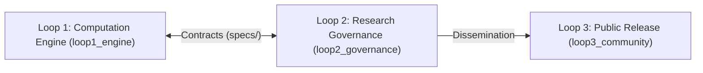
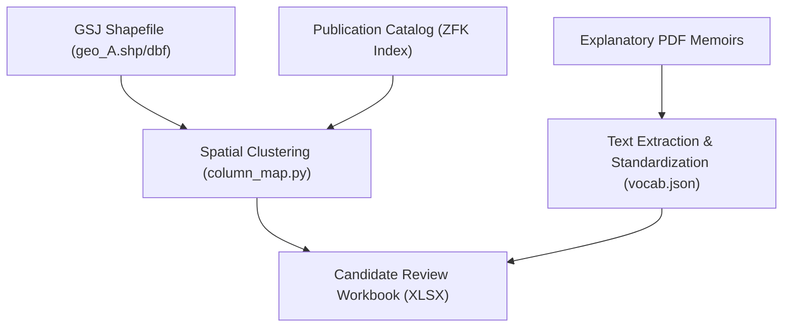

# Macrostrat Japan: Automated Construction and Quality Verification System for Stratigraphic Columns based on GSJ 1:50,000 Geological Map Series

---

## 1. Abstract

This paper presents the design and implementation of **Macrostrat Japan**, an automated geoinformatics data pipeline that extracts, compiles, and verifies stratigraphic columns and lithological attributes from the Geological Survey of Japan (GSJ) 1:50,000 geological map series, 1:200,000 seamless geological vectors, and explanatory PDF memoirs into the international **Macrostrat** crustal database standard.

To accommodate complex geological structures including accretionary complexes, volcanic successions, and Quaternary terrace suites without external GIS dependencies, the system integrates deterministic zero-dependency binary parsers (`shape_source.py`, `column_map.py`) with language-model-based text parsing under a strict 3-loop governance architecture.

---

## 2. System Architecture

The architecture enforces strict physical boundary separation across three operational loops to decouple autonomous AI computations, human scientific governance, and public dissemination:

### Loop Responsibilities
- **Loop 1 (`loop1_engine/`)**: Execution environment for deterministic ESRI Shapefile/DBF parsing, PDF information extraction, and automated regression testing (73 tests passed).
- **Loop 2 (`loop2_governance/`)**: Command center for the Principal Investigator to govern task directives (`TASK.md`), review candidate workbooks (XLSX), track prior art (`research_hub/`), and approve ground-truth datasets.
- **Loop 3 (`loop3_community/`)**: Public dissemination layer providing peer-reviewed specifications, GitHub release protocols, and academic writing standards.

---

## 3. Data Extraction Pipeline and Attribute Determination Methodology

Stratigraphic attributes are deterministically derived from three GSJ primary sources (50k vectors `geo_A.shp`/`geo_A.dbf`, PDF memoirs, and publication catalog ZFK):

### Attribute Determination Rules
1. **Unit Identification (`unit_name` / `strat_name`)**: Extracted from `geo_A.dbf` legend records and PDF text descriptions, standardizing stratigraphic ranks (Group, Formation, Member).
2. **Column Footprint Partitioning (`col_id`)**: When multiple sub-regional columns exist within a quadrangle (e.g., Western, Central, and Eastern areas), spatial boundaries are calculated by Voronoi nearest-neighbor clustering seeded by exclusive-unit polygons (`column_map.py`).
3. **Geochronology (`t_age_ma`, `b_age_ma`, `t_int`, `b_int`)**: Mapped to the International Chronostratigraphic Chart (ICS 2023/09) via `intervals.json`.
4. **Lithology Mapping (`lithology` / `minor_lith`)**: Conformed to the Macrostrat controlled vocabulary (`vocab.json`). Non-standard terms are synthesized (e.g. `sandstone; mudstone`).
5. **Depositional Environment (`environment`)**: Extracted from sedimentary facies descriptions and normalized to standard terms (`marine`, `open shallow subtidal`, `non-marine`, `alluvial fan`).
6. **Stratigraphic Position Monotonicity (`b_prop`, `t_prop`)**: Computed as normalized relative positions within each chronostratigraphic interval ($0.0 \le b\_prop < t\_prop \le 1.0$).
7. **Basal Contact Relationship (`basal_surface`)**: Standardized from map boundary types into `conformable`, `unconformable`, `fault`, or `intrusive`.
8. **Evidence Provenance (`Evidence`)**: Fully indexed with memoir page citations and direct text quotations to ensure 100% auditability.

---

## 4. Quality Verification Standards (5 Invariants)

All generated workbooks undergo mechanical validation via `python run.py audit` against 5 core invariant conditions:

| Invariant | Description | Pass Criteria |
| :--- | :--- | :--- |
| **1. Unit Completeness** | Complete coverage of all geological units in the quadrangle legend | 0 missing units |
| **2. Vocabulary Conformance** | Conformance of `lithology` and `environment` to `vocab.json` | 0 non-standard terms |
| **3. Age Monotonicity** | Strict mathematical ordering ($b\_age\_ma \ge t\_age\_ma$) | 0 chronostratigraphic inversions |
| **4. Stratigraphic Monotonicity**| Bounded position values ($0.0 \le b\_prop < t\_prop \le 1.0$) | 0 out-of-bound values |
| **5. Evidence Provenance** | Explicit citation text and page numbers for all resolved attributes | 0 unreferenced fields |

---

## 5. Implementation Benchmark: GSJ Quadrangle m1286 "Ichinohe" (2018)

- **Total Units**: 30 (Jurassic accretionary complex, Cretaceous plutons, Neogene sedimentary rocks, Quaternary terraces and pyroclastic flows).
- **Audit Result**: **PASS (0 errors, 0 warnings, 0 unresolved units)**.
- **Evidence Provenance**: 81 citations directly mapped to GSJ Memoir text (pp. 17–118).