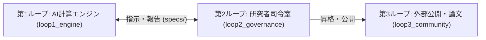
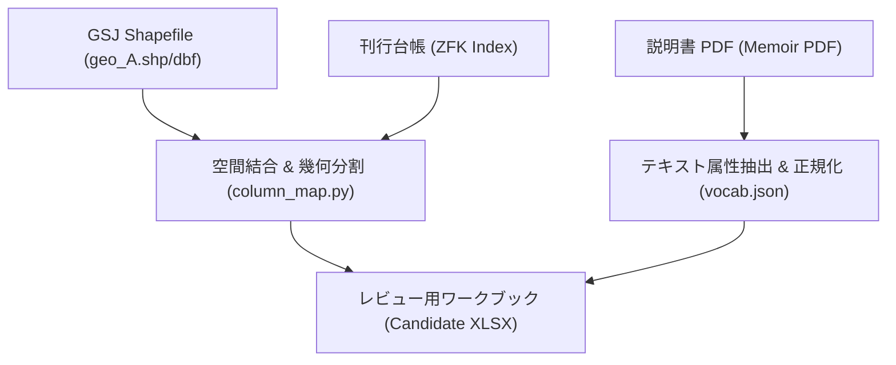

# 産業技術総合研究所 5万分の1地質図幅に基づく層序柱状図自動構築とデータ品質検証システム

---

## 1. 概要

本研究は、産業技術総合研究所 地質調査総合センター（GSJ）刊行の5万分の1地質図幅（ベクトルデータ・説明書PDF・刊行台帳）から、国際地質年代データベース「Macrostrat」に準拠した層序柱状図（Stratigraphic Column）および地質属性データを抽出・構造化・検証する情報処理パイプラインの設計と実装について報告する。

日本の複雑な地質構造（付加体、火山岩類、第四紀段丘群）に対応するため、外部 GIS ソフトウェアに依存しない決定論的空間幾何演算（`shape_source.py`, `column_map.py`）と大規模言語モデルによるテキスト解析を統合し、研究者による検証（Human-in-the-Loop）を可能にする多重ループ構成を採用した。

---

## 2. システムアーキテクチャ

システムは、AIによる計算処理、研究者によるデータ検証、および外部公開の責務を物理的に分離した 3 重ループ構造で構成される。

### 各ループの責務
- **第1ループ (`loop1_engine/`)**: Python 標準ライブラリによる Shapefile / DBF バイナリ解析、PDF テキストからの地質属性抽出、自動テストスイート（73件 PASS）の実行領域。
- **第2ループ (`loop2_governance/`)**: 研究責任者が統合ポータルを通じてタスク指示を発行し、生成された候補ワークブック（XLSX）と手動正解データ（Ground Truth）の照合・先行研究調査（`research_hub/`）を行う領域。
- **第3ループ (`loop3_community/`)**: 研究者により検証・承認されたデータを、国際標準 Macrostrat 形式および学術論文として公開する領域。

---

## 3. データ処理パイプラインと層序属性の決定方法論

GSJ の 3 大データソース（50k ベクトル `geo_A.shp` / `geo_A.dbf`、地質図幅説明書 PDF、刊行台帳 ZFK）から、以下のアルゴリズムにより層序属性を一意に決定する：

### 各層序属性の決定アルゴリズム
1. **地層・岩体名 (`unit_name` / `strat_name`)**: `geo_A.dbf` の凡例レコードおよび説明書 PDF 各論から和名・英名を抽出し、層序階層（層群・累層・部層）を正規化。
2. **柱状図地域区分 (`col_id` / Column Footprint)**: 図幅内に複数の柱状図領域（例: 東部・西部・中央部）が存在する場合、特定地域にのみ出現する地層（Exclusive-unit）ポリゴンをシードとしてボロノイ近傍分割を行い、各共有ポリゴンの帰属地域と代表座標を幾何学的に決定（`column_map.py`）。
3. **年代数値および時代区間 (`t_age_ma`, `b_age_ma`, `t_int`, `b_int`)**: ICS 国際層序対比表（2023年版）に基づき、上限年代・下限年代の数値（Ma）および時代区間名を一意にマッピング。
4. **主要岩相 (`lithology` / `minor_lith`)**: `geo_A.dbf` の岩相記述および説明書本文から、Macrostrat 公式統制語彙（`vocab.json`）の用語へマッピング。非統制語は合成語彙（例: `sandstone; mudstone`）へ正規化。
5. **堆積環境・形成場 (`environment`)**: 説明書の堆積相記載（陸成、浅海、半深海、付加体深海堆積物など）に基づき、公式語彙（`marine`, `open shallow subtidal`, `non-marine`, `alluvial fan` 等）を特定。
6. **相対層厚位置 (`b_prop`, `t_prop`)**: 同一時代区間内における層序学的上下関係に基づき、区間内の相対位置を $0.0 \le b\_prop < t\_prop \le 1.0$ の範囲で線形計算。
7. **下限境界の層序関係 (`basal_surface`)**: 地質図幅凡例の境界線種別（整合、不整合、衝上断層、貫入面）に基づき、`conformable`, `unconformable`, `fault`, `intrusive` を設定。
8. **エビデンス保持 (`Evidence`)**: 決定された各属性値に対し、説明書 PDF の該当ページ番号および原文引用テキストを `Evidence` シートに記録（トレーサビリティの完全保証）。

---

## 4. データ品質検証基準 (5つの不変条件)

パイプラインから出力されたすべてのワークブックは、機械検証スクリプト（`python run.py audit`）により以下の 5 つの不変条件について自動検証される：

| 検証項目 | 検証内容 | 合格基準 |
| :--- | :--- | :--- |
| **1. Unit Completeness** | 図幅凡例に記載された全地質ユニットの網羅性 | 欠損率 0% |
| **2. Vocabulary Conformance** | `lithology`, `environment` の公式語彙適合性 | 非統制語 0件 |
| **3. Age Monotonicity** | 年代順序関係の単調性 ($b\_age\_ma \ge t\_age\_ma$) | 逆転・矛盾 0件 |
| **4. Stratigraphic Monotonicity**| 相対層厚位置の包含性 ($0.0 \le b\_prop < t\_prop \le 1.0$) | 範囲外 0件 |
| **5. Evidence Provenance** | 抽出された全属性値に対する原文引用の存在 | 根拠未記載 0件 |

---

## 5. 実装検証: 5万分の1地質図幅「一戸」(2018年GSJ刊行)

岩手県・青森県境に位置する「一戸」図幅（図幅番号: m1286）を対象に検証を実施した：
- **対象層序ユニット数**: 30 ユニット（ジュラ紀付加体、白亜紀深成岩類、新第三紀堆積岩類、第四紀段丘堆積物・火砕流堆積物）
- **検証結果**: **全5項目 PASS（エラー 0件、警告 0件、未解決属性 0件）**
- **エビデンス記録**: 全30ユニット・121属性に対し、説明書本文（pp. 17–118）から計81件の引用文を完全対応付け。